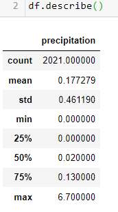
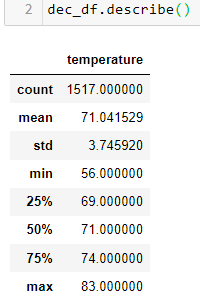
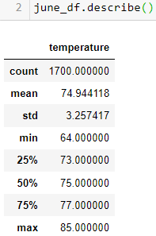

# Surfs_Up

## Overview of Project

An investor has requested weather analysis prior to backing a proposed Surf N Shake Shop. Earlier analysis this project showed the average precipitation per day over the previous year showed an acceptable average precipitation (0.18 inches). Additionally, most days of the year (325 of 365) averaged at 67 degrees F, a great temperature.

### Purpose

This project expands upon earlier annual analysis diving deeper into June and December temperature data  in Oahu to measure year-round sustainability of the proposed business.

### Deliverables

1. Determine Summary Statistics for June
2. Determine Summary statistics for December
3. Written README.md report of the statistical analysis

## Results

The observed results include:

1. June has a slightly higher average temperature that December (71  vs 75 degrees).
2. The minimum temperature in 8 degrees lower in December: 56 degrees vs 64 in June.
3. The maximum temperature are comparatively close (83 degrees in Dec. vs 85 in June).

## Summary

December appears to be a cooler month compared to June, but a 4 degree difference is not very significant. 71 degree averages in December still make this location very desirable Surf N Shake. Both months share a similar max temp, in the mid 80s, however, with an average low of 56 degrees in December, the business should anticipate a few slow days.

### Resources

- Data Sources: hawaii.sqlite
- Technology: SQLite, SQLAlchemy, VS Code, Jupyter Notebook 6.4, Python 3.7